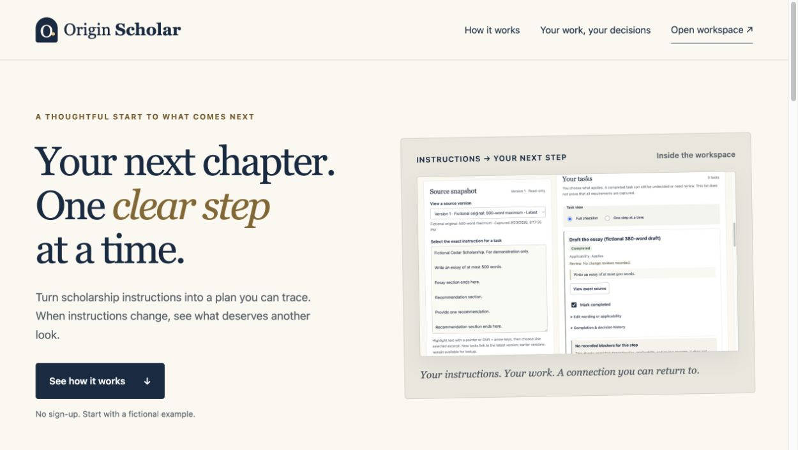
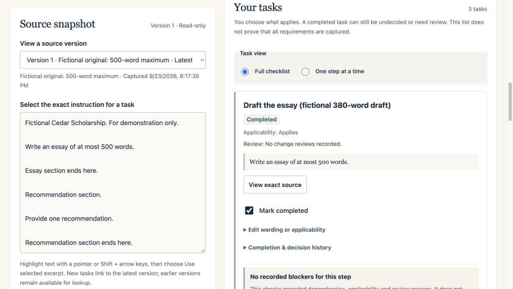

# Origin Scholar — application preparation

Link a task to the exact instruction that prompted it. When instructions change, see which recorded work needs another look without losing completion history.

Origin Scholar (formerly StepTrace) is a local-first **alpha** for adults preparing college scholarship applications. It uses JavaScript, HTML and CSS, with no package dependencies, account, text-upload service or AI model. Use fictional information in this release. A person decides applicability and resolves uncertainty; the app does not decide eligibility, guarantee completeness or submit applications.

**Human evaluation is pending: 0 participants.** [Explore Origin Scholar](https://originscholar.pages.dev) · [Open the workspace](https://originscholar.pages.dev/workspace) · [Public source](https://github.com/Nile54/steptrace-app-prep). The product was renamed during the design milestone; repository identity and existing backup formats are retained. Exact publication status and source version are recorded in [RELEASE](docs/RELEASE.md).

## Run locally

Install Node.js 22 or later, then run these commands from this repository:

```sh
./run.sh
```

Open [the landing page](http://127.0.0.1:4173), then [the workspace](http://127.0.0.1:4173/workspace.html). No dependency installation or build is needed for local development. Stop the server with Ctrl+C. The launcher can also use the existing bundled Codex Node runtime on the original development Mac.

On platforms without a POSIX shell, use `node scripts/serve.mjs`. The equivalent check, evaluation and release commands are `node scripts/check.mjs`, `node scripts/evaluate.mjs` and `node scripts/build-release.mjs`.

```sh
./run.sh check         # Regression tests, syntax and fixture checks
./run.sh evaluate      # Clearly labeled synthetic correctness report
./run.sh evaluate-ui   # Local volunteer kit at http://127.0.0.1:4196/evaluation/
./run.sh build         # Static release files in ignored work/release/
```

`dist/` contains authored source. The release builder copies only public app assets, gives the service worker a shell revision and records source/asset hashes in `release.json`. The evaluation kit, test endpoints and local records are excluded. Deployment requires a host serving the built files at its origin root over HTTPS; see [architecture and release boundaries](docs/ARCHITECTURE.md).

## Try the before/after flow

1. Open **See how it works · Try the fictional plan**, then **Create and confirm fictional plan**. The separate sample has a completed 380-word draft, completed proofreading that depends on it, and a completed recommendation task.
2. Prepare a JSON backup. Choose **Fill fictional 400-word update**, **Preview changes**, then **Save new source version**.
3. Review the old 500-word and new 400-word excerpts. Drafting and proofreading need review, while all three completion records survive. The unchanged recommendation has no open review. A 380-word draft is not automatically invalid.
4. Inspect the added unreviewed text, then choose **Add undecided conditional task**. Applicability stays **Not decided** until a person chooses.

The [short walkthrough](docs/DEMO.md) includes genuine interface captures and separate source, downstream and work-change reviews. [Detailed usage](docs/USAGE.md) covers source selection, manual tasks, dependencies, backup/restore, keyboard options and recovery. The main example uses the real model and storage; `/preview.html` is the older, explicitly scripted preview.





## What is implemented

- Immutable pasted/plain-text source snapshots and exact, version-specific task excerpts; manual tasks have an explicit no-source label.
- Deterministic before/after comparison, conservative matching and human-confirmed mappings. Added unlinked material remains visible.
- User-confirmed dependencies with cycle checks and explained downstream review. Multiple reasons and newer updates stay independent.
- Separate completion, applicability and review histories. **I changed this work** records a person's report; it does not inspect external files.
- Validated local saves, previewed additive JSON restore, legacy backup readers, visible save failures and same-tab draft recovery.
- Keyboard controls, one-step/full views and offline app loading after successful setup in a supported browser.

## Evidence and limitations

The [Session 6 evaluation](docs/EVALUATION.md) records 126 passing automated tests at that milestone. Each of two matched fictional briefs produced three expected affected-task flags, with no misses or extra flags. Two stress scenarios each produced one extra review of an unchanged recommendation. These are synthetic correctness results, not participant performance or proof of demand. The design milestone retains those results and adds navigation coverage: **134 tests passed locally and on Node 22/24 in [remote CI](https://github.com/Nile54/steptrace-app-prep/actions/runs/36015906951)**. Exact release status is recorded in RELEASE. [CHECKS](docs/CHECKS.md) records the public-interface and recovery checks.

No one has yet completed the human comparison. Lookup time, setup effort, comprehension, accessibility benefit and preference remain unmeasured. The [adult-volunteer protocol](docs/EVALUATION-PROTOCOL.md) compares an ordinary checklist using matched briefs and four counterbalanced orders. One consenting adult trying both assigned blocks is the smallest next feedback action; a complete four-person batch balances order. No recruitment has been performed.

Automatic matching requires a unique exact paragraph and phrase in stable immediate context. Harmless formatting, repeated phrases and changed neighboring text can require extra confirmation. The app does not understand semantic contradictions, distant conditions, missing user-created relationships or unreported edits. Read the [matching tradeoff](docs/ARCHITECTURE.md#matching-tradeoff).

Use one editing tab and keep separate JSON backups. Browser storage can fail or disappear; it is not a backup or encryption. Restore only adds applications with disjoint IDs; replacement restore, deletion, deduplication and reopening a recorded resolution are not implemented. There is no OCR, scraping, submission, cloud sync or payment system.

## Privacy, accessibility and prior art

Application text is processed in the browser and rendered as text. App loading and update checks still request static files over the network. A public host can receive ordinary request metadata; local processing is not a promise of zero network traffic or privacy from browser extensions. See [privacy and recovery notes](docs/PRIVACY.md).

Native controls, visible labels, focus handling and textual review reasons support the accessibility goal. Automated checks and agent-operated walkthroughs do not establish complete WCAG conformance or benefit for users. [Accessibility notes](docs/ACCESSIBILITY.md) distinguish implemented behavior from untested needs.

Change-impact traceability has established prior art in IBM DOORS and Jama. Origin Scholar’s unproven hypothesis is a smaller consumer preparation workflow, not invention of traceability. [Sources and related work](docs/SOURCES.md) identify the overlap and naming conflicts. [Architecture](docs/ARCHITECTURE.md) explains the modules and invariants.

## License and development

[MIT](LICENSE): reuse, modification and commercial redistribution are permitted with the copyright/license notice retained; the software is provided without warranty. The license does not establish a hosting provider's suitability for a future paid service.

Read [AGENTS](AGENTS.md), [BRIEF](docs/BRIEF.md), [ROADMAP](docs/ROADMAP.md) and [STATE](docs/STATE.md) before continuing a milestone. Preserve user work and historical data, implement only the requested scope, run relevant checks and update the evidence honestly.

## Design and hosting

The landing page uses navy, cream and gold, a text wordmark, system fonts and an actual 81 KB interface screenshot. “See how it works” leads to a short walkthrough; the workspace remains a separate working surface with source/task columns, explicit completion and review counts, and narrow-screen stacking. [Design blueprint and validation](docs/DESIGN.md).

Cloudflare Pages Free is the selected host, using a direct upload of the reviewed static artifact. GitHub remains the source and CI host; pushing source does not automatically deploy the Pages project. No domain was purchased. Free limits and terms can change.

**Moving saved work from the earlier address:** the new hostname has separate browser storage. Export a JSON backup from the old workspace and preview/restore it in Origin Scholar. Existing records are not transferred automatically. Do not clear the old site’s storage until you have checked the separate backup.
