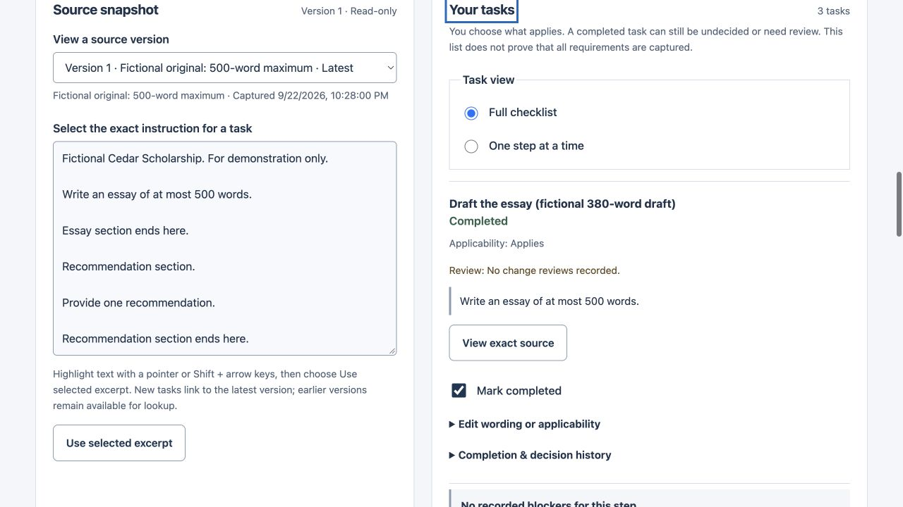
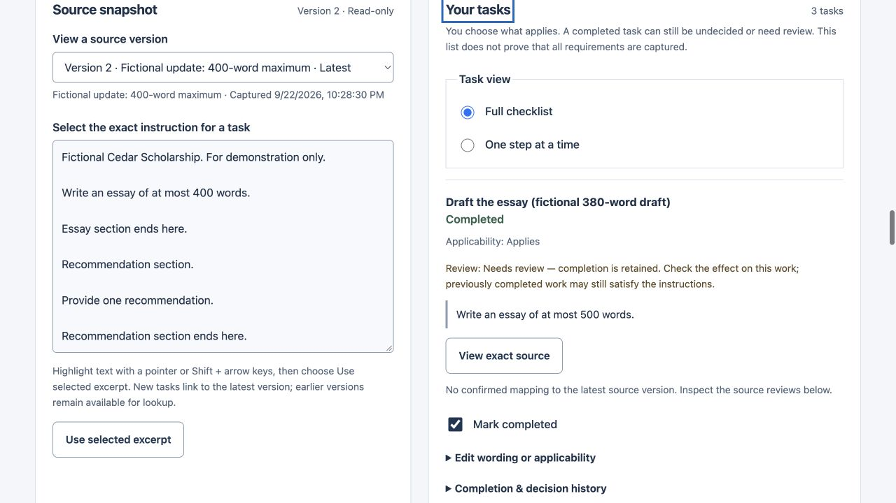

# Fictional before/after walkthrough

Run `./run.sh` and open [the local workspace](http://127.0.0.1:4173), or use a verified public URL recorded in [STATE](STATE.md). Use one editing tab. This example uses fictional instructions and normal model/save operations; it contains no actual essay or recommendation letter.

## Before the update

1. Open **Try a fictional dependency example** and choose **Create and confirm fictional plan**. It adds a separate Cedar Scholarship application and explicitly confirms that proofreading depends on drafting. Existing applications remain.
2. Inspect the three completed tasks: **Draft the essay (fictional 380-word draft)**, **Proofread the essay** and **Request recommendation**. Expand **This step depends on…** under proofreading.
3. Choose **View exact source** under the draft. Its version-1 instruction says “Write an essay of at most 500 words.” Use **Return to task** to return to the task heading.
4. In **Backup & restore**, choose **Prepare JSON backup**, then download or copy it into a separate file. Verify the file exists; preparing the on-page field alone is not a backup.

## After the update

5. Choose **Fill fictional 400-word update**, then **Preview changes**. Inspect the 500/400-word excerpts and added condition. Nothing is applied until **Save new source version**.
6. Save the version. Drafting receives a direct source review, and proofreading receives a separate reason explaining the dependency. All three completion records survive. The recommendation remains complete without an open review. The app has not inspected the essay and does not declare its described 380 words invalid.

7. Inspect the unreviewed added passage: “If you are applying part-time, include a study plan.” Choose **Add undecided conditional task**. The exact new source is linked and applicability remains **Not decided**. An existing checklist is not presented as covering new material.

## Make the human decisions separately

8. Open the draft's source review, select the intended new excerpt, choose applicability and record the mapping resolution. This resolves that specific source review only. If applicability is unknown, leave it **Not decided**; a mapping decision does not establish eligibility.
9. Inspect proofreading's causal reason and record what was reviewed separately. This action cannot clear another task's reason or a newer source version.
10. Under the draft, use **I changed this work** to report a fictional revision. Proofreading receives a new work-change reason without changing the source instructions. This is a manual report, not observation of an external document.
11. Prepare a new JSON backup, reload and return to the exact version-1 source. To demonstrate restoration, use a separate empty test origin/browser profile, preview the backup and explicitly apply it. Importing into the same workspace correctly rejects duplicate IDs. Do not clear existing work to force the demo to pass.

Source versions, links, histories, human choices, dependency reasons and backup/restore are working behavior. The 380-word draft is an authored fictional description, not a measured file. The separate `/preview.html` page is the original scripted preview and should not be presented as the working implementation.

This walkthrough is an engineering demonstration, not a participant study. [EVALUATION](EVALUATION.md) records human sample size zero, synthetic results and the smallest remaining feedback action. [CHECKS](CHECKS.md) records which release and browser actions actually ran.
